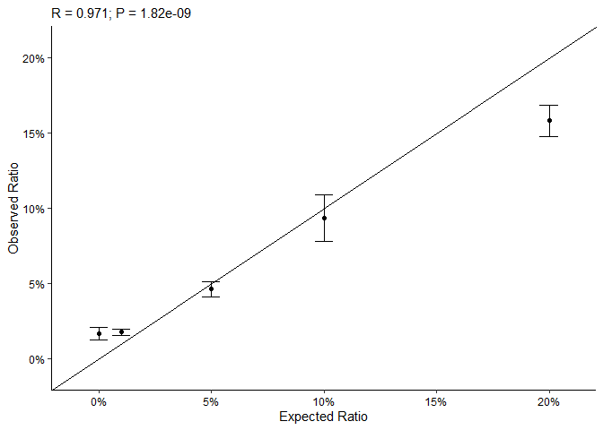

<!-- README.md is generated from README.Rmd. Please edit that file -->

# qNCIN

<!-- badges: start -->
<!-- badges: end -->

## Installation

You can install the development version of qNCIN like so:

``` r
# install.packages("devtools")
devtools::install_github("thereallda/qNCIN")
```

## Quick Start

### Load package

``` r
library(tidyverse)

# if you do not have `enONE` package installed, run the following code first: 
# devtools::install_github("thereallda/enONE")
if (!requireNamespace("enONE", quietly = TRUE)) { devtools::install_github("thereallda/enONE") }
library(enONE)
library(qNCIN)
```

### Load data

``` r
counts_df <- read.csv("data/Counts.csv", row.names = 1)
meta <- read.csv("data/metadata.csv")

# metadata for synthetic RNA
syn_id <- paste("syn",3:7, sep = "_")
syn_meta <- data.frame(
  id = syn_id,
  per = c(0.05,0.01,0.20,0,0.10)
)
```

### Filtering

``` r
counts_keep <- FilterLowExprGene(counts_df, 
                                 group = meta$condition,
                                 min.count = 20)
```

### Generate Factors

``` r
# scale factor
sf1 <- calcScaleFactor(counts_keep,
                       spike.in.prefix = "FB",
                       enrich.group = meta$condition,
                      )
# adjust factor
af1 <- calcAdjustFactor(counts_keep,
                        spike.in.prefix = "FB",
                        enrich.group = meta$condition,
                        scale.factor = sf1,
                        prop.top.enrich = 1,
                        pseudo.count = 5
                        )
```

### Calculate Ratio

``` r
qratio_df <- calcNCIN(counts_keep,
                      spike.in.prefix = "FB",
                      enrich.group = meta$condition,
                      scale.factor = sf1,
                      adjust.factor = af1,
                      filter = T,
                      pseudo.count = 5
                      )
head(qratio_df);dim(qratio_df)
#>                       Y1_YCNT    Y2_YCNT    Y3_YCNT  ratio.avg    ratio.sd
#> ENSMUSG00000100954 0.04807636 0.03020371 0.01856551 0.03228186 0.014864774
#> ENSMUSG00000051285 0.26659949 0.19720646 0.36881708 0.27754101 0.086326927
#> ENSMUSG00000048538 0.06648085 0.08685147 0.11926681 0.09086638 0.026621029
#> ENSMUSG00000057363 0.04284696 0.05858117 0.04096649 0.04746487 0.009672800
#> ENSMUSG00000033021 0.03671701 0.05358583 0.04854183 0.04628156 0.008658576
#> ENSMUSG00000061024 0.04216911 0.07010574 0.07261291 0.06162925 0.016899536
#> [1] 9037    5
```

### Synthetic RNA Calibration curve

``` r
synScatter(ratio.df = qratio_df[,1:3], syn.meta = syn_meta)
```


